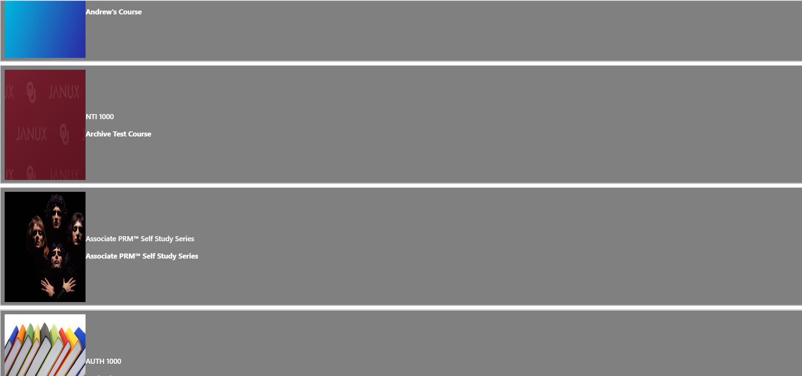

# nti.web.embeds

## Overview
This branch is used for the development and maintenance of embedable web elements. These web elements include course cards and course catalogues. Customers can embed these elements into their own sites with the help of the builder component.
## The Project
This project works as a builder widget for an LMS. It takes as input from the user variables such as light/dark mode and row/ column layout and matches the course cards to those preferences. It also constructs an iframe that the user could take an embed into their own html page. Some course cards are loaded on to the page as a default to show the user what their selected preferneces would look like. Additionally, clicking on one of those course cards would lead the user to that course NextThought's website catalog.
## Prerequisites
Before starting installation, make sure you have the following installed on your computer:
- Node.js version v13.6.0
- npm version 6.13.4
## Installation
You can set up this environment on your own computer by following these steps:
1. Clone the repository
2. Open the Node.js command prompt
3. Navigate to the 'src' folder (relative path - nti.web.embeds/src)
4. Run 'npm install'
## How to run (User guide)
1. Make sure to pull the latest version
2. Make sure your package.json (found in src directory) file shows this.  *If it does now show the correct line in the boxed region, fix before continuing. **It will not work if you miss this!**

3. Run the following commands in your command terminal:
  - 'npm build' -or (Mac users)- 'npm run-script build' (First time only!)
  - 'npm run start'
4. Go to this link: http://127.0.0.1:3006/build/index.html?darkmode=false&direction=row&courseID=https://alpha.nextthought.com/dataserver2/++etc++hostsites/alpha.nextthought.com/++etc++site/Courses/DefaultAPICreated/OUCS-2/CourseCatalogEntry 

It should look like the following image

5. Make sure you keep the local server running as you follow the next steps (you can close out of the browser but don't stop the program).  This is the source that we need to pass to the iframes making up the catalog.
6. You will have to clone the repo again, this time to a DIFFERENT directory than the one you've been using up till now and then fetch, checkout the catalog branch.  Below are the commands to do it:

   - mkdir CatalogApp

   - cd CatalogApp

   - git clone  https://github.com/NextThought/nti.web.embeds.git

   - git fetch origin catalog

   - git checkout catalog

   - cd .. 
   
When these steps are done, the directory should look like this

7. Move to the src folder then build and run the app. You can do this by using the following commands:
     - cd Catalog/src
     - 'npm build'
     - 'npm run start'
     - If this does not work, run 'npm install' before 'npm build'
     
8. Go to http://localhost:3000/. You should see this:

## Course card 
The course card components display the title, image, and quick description of any available course. The component can be altered in terms of light or dark mode and row or column display. You can embed this component using the builder component. You can find the javascript file for the course card under /src/src/components/Card.js .
## Catalogue 
The catalogue component displays a list of many course cards. This component can also be altered in terms of light or dark mode. You can embed this component using the builder component. You can find the javascript file for the catalogue under /src/src/components/CourseCatalogue.js .
## Builder 
The builder component allows users to select what component they would like to embed and produce they code they need to insert into an HTML file. This is done by allowing users to input dark/light mode and orientation as well as a link (to the course for the course card or to multiple courses for the catalogue). You can find the javascript file for the catalogue under /src/src/components/Builder.js .
